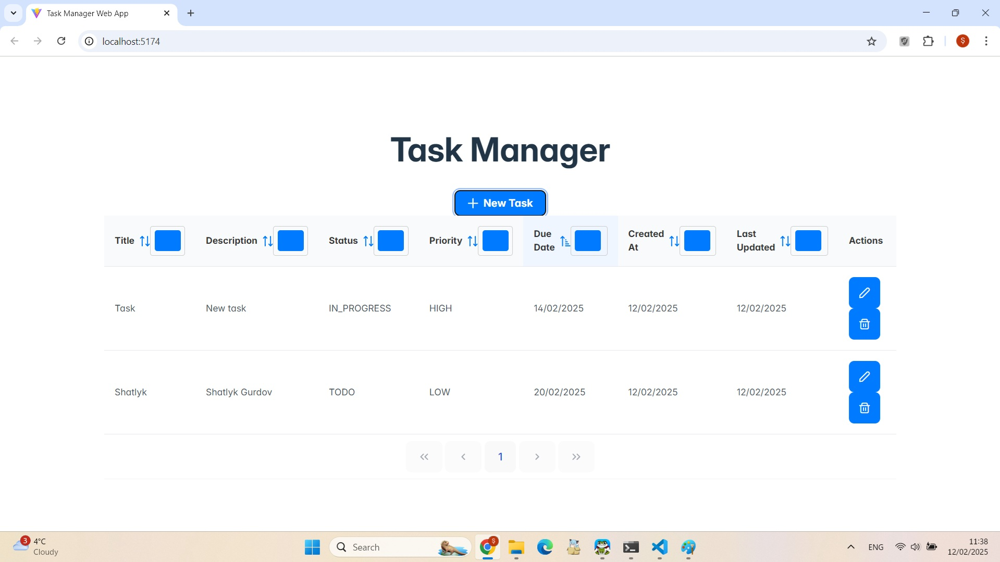

# Task Manager Web Application 📝

This project is a basic Task Manager web application that allows users to: Create, read, update, and
delete (CRUD) tasks.

---

## **🚀 Features**
✔ **Frontend:** Built with **ReactJS (Vite), HTML5, CSS3, PrimeReact**  
✔ **Backend:** Developed using **Node.js (Express.js), MongoDB (Compass)**  
✔ **REST API:** Implements **CRUD operations (Create, Read, Update, Delete)**  
✔ **Task Attributes:**
  - **Title** (required, max **100** chars)
  - **Description** (optional, max **500** chars)
  - **Status** (**TODO, IN_PROGRESS, DONE**)
  - **Due date** (**DD/MM/YYYY**, handled using `date-fns`)
  - **Priority** (**LOW, MEDIUM, HIGH**)
  - **Creation Timestamp**
  - **Last Updated Timestamp**
✔ **PrimeReact UI Components (DataTable, Dialog, Dropdown, Calendar)**  
✔ **MongoDB for persistent data storage**  
✔ **Backend hosted via RESTful API**  

---

## **⚡ 1. Setup Instructions**
### **📌 Prerequisites**
- **Node.js (v16 or higher)** - [Download](https://nodejs.org/)
- **MongoDB Compass** (for local MongoDB) - [Download](https://www.mongodb.com/try/download/compass)
- **Git** (for version control) - [Download](https://git-scm.com/)
- **VS Code** (recommended editor) - [Download](https://code.visualstudio.com/)

---

### **📌 2. Clone the Repository**
```sh
git clone https://github.com/shatlykgurdov/task-manager.git
cd task-manager

📌 3. Backend Setup (Node.js & Express.js)

Navigate to the backend folder:
cd backend

Install:
npm install  

Create a .env file inside the backend/ folder:
touch .env

Add the following:
MONGO_URI=mongodb://localhost:27017/task-manager
PORT=5000

Start the backend server:
npm start
✅ Backend runs at: http://localhost:5000


📌 4. Frontend Setup (ReactJS & PrimeReact)
Open a new terminal and navigate to the frontend folder:
cd ../frontend

Install:
npm install

Start the frontend:
npm run dev
✅ Frontend runs at: http://localhost:5173

🔥 5. API Documentation (Backend)
Base URL: http://localhost:5000/api
📌 Create a Task
http
POST /api/tasks
Body:
json
{
  "title": "My Task",
  "description": "Complete project",
  "status": "TODO",
  "priority": "HIGH",
  "dueDate": "2025-02-11"
}

✅ Response:
json
{
  "message": "Task created successfully",
  "task": { ... }
}


📌 Get All Tasks
http
GET /api/tasks
✅ Response:
json
[
  {
    "_id": "123456",
    "title": "Task 1",
    "description": "Details...",
    "dueDate": "10/02/2025",
    "createdAt": "11/02/2025 20:15",
    "updatedAt": "11/02/2025 21:38"
  }
]

📌 Update a Task
http
PUT /api/tasks/:id
Body:
json
{
  "title": "Updated Task",
  "status": "IN_PROGRESS",
  "dueDate": "15/02/2025"
}

📌 Delete a Task
http
DELETE /api/tasks/:id
✅ Response:
json
{
  "message": "Task updated successfully"
}


📌 6. Project Approach & Assumptions
📌 Approach
Frontend: Developed using ReactJS, HTML5, CSS3, PrimeReact
Backend: Built with Node.js (Express.js), MongoDB (NoSQL document-based DB)
Date Handling: Uses date-fns for:
Formatting (DD/MM/YYYY)
Parsing dates (YYYY-MM-DD → DD/MM/YYYY)
Ensuring correct timezone conversion
REST API: Implements basic error handling and validation
CRUD Operations: Fully functional task management system
Version Control: Code is stored in GitHub, access provided to "InternationalTradeCentre"
📌 Assumptions
Each task has a unique identifier.
Tasks always follow the DD/MM/YYYY format.
MongoDB is locally hosted using MongoDB Compass.
📌 Limitations
No authentication (public access to tasks).
No cloud-hosted database (local MongoDB only).
No role-based access control (Admin/User roles).


📌 7. Screenshots

Below are some screenshots of the Task Manager Web Application:

### **🏠 Home Page**


### **📝 Create a New Task**


### **✏️ Edit a Task**


### **❌ Delete a Task**


### **📋 Task Table (List of Tasks)**


👤 8. Author
Name: SHATLYK GURDOV
GitHub: https://github.com/shatlykgurdov


